# LexAI 智能法律工作台 · 用户手册

> 版本：v1.0　|　适用系统版本：LexAI（前后端分离版）　|　编写日期：2026-06-30

---

## 目录

1. [产品简介](#1-产品简介)
2. [运行环境与准备](#2-运行环境与准备)
3. [启动与登录系统](#3-启动与登录系统)
4. [界面总览与导航](#4-界面总览与导航)
5. [工作台（Dashboard）](#5-工作台dashboard)
6. [法律咨询](#6-法律咨询)
7. [案件分析](#7-案件分析)
8. [合同起草](#8-合同起草)
9. [合同台账](#9-合同台账)
10. [合同审查](#10-合同审查)
11. [合同审查流程记录](#11-合同审查流程记录)
12. [AI 会话历史的查看与恢复](#12-ai-会话历史的查看与恢复)
13. [常见问题（FAQ）](#13-常见问题faq)

---

## 1. 产品简介

**LexAI** 是一个面向法律咨询、案件分析、合同起草与合同审查场景的智能法律工作台。系统将「合同 → 起草 → 审查 → 决策 → 归档」打造成一条完整的工作流闭环，并由 AI 能力贯穿其中。

**核心能力：**

| 功能模块 | 作用 |
|----------|------|
| 工作台 | 数据概览、统计图表、待办与最近 AI 活动一屏总览 |
| 法律咨询 | 针对具体法律问题给出领域识别、法律依据、应对建议与风险提示 |
| 案件分析 | 梳理案情，输出关键事实、争议焦点、证据缺口与后续动作 |
| 合同起草 | 根据元信息与需求由 AI 自动生成合同正文，并支持人机协同改写 |
| 合同台账 | 所有合同的主数据中心，管理合同全生命周期 |
| 合同审查 | 对单份合同执行 AI 风险识别 + 人工复核决策 |
| 流程记录 | 跟踪每一次合同审查申请，支撑人工决策闭环 |

**AI 技术底座：** 腾讯混元大模型（hunyuan-lite）× 得理法律开放平台（法规/类案检索）× 本地知识库 RAG（TF-IDF 检索）。

> 💡 **AI 运行模式**：系统支持两种模式。
> - **真实模式（tencent）**：接入真实大模型与法律 API，需配置密钥。
> - **Mock 演示模式（mock）**：无需密钥即可体验全部界面与流程，AI 返回演示数据。
> 当前模式可在「工作台 → 系统运行状态」中查看。

---

## 2. 运行环境与准备

| 项目 | 要求 |
|------|------|
| 操作系统 | Windows 10/11、macOS、Linux |
| 浏览器 | Chrome / Edge / Firefox 最新版（推荐 Chrome） |
| 后端运行环境 | Java 21 |
| 前端运行环境 | Node.js 18+ |
| 数据库 | MySQL（可选；本地未配置时自动使用内置 H2） |

> 普通使用者无需关心数据库与密钥配置，按照下一节的一键脚本启动即可。

---

## 3. 启动与登录系统

### 3.1 一键启动（推荐）

在项目根目录打开终端，执行：

```bash
# macOS / Linux
chmod +x start.sh stop.sh
./start.sh              # 后台启动（自动检测 Java、数据库、AI 模式）
./stop.sh              # 停止全部服务
```

```bat
:: Windows
start.bat              :: 启动
stop.bat               :: 停止
```

启动成功后，访问地址：

- **前端页面**：http://localhost:5173
- **后端接口**：http://localhost:8081/api


### 3.2 打开系统

在浏览器地址栏输入 `http://localhost:5173`，回车后将自动跳转到**工作台**首页。

> 当前版本为内部工作台，默认以管理员工作区（Admin Workspace）身份进入，**无需账号登录**。左下角会显示当前用户身份。

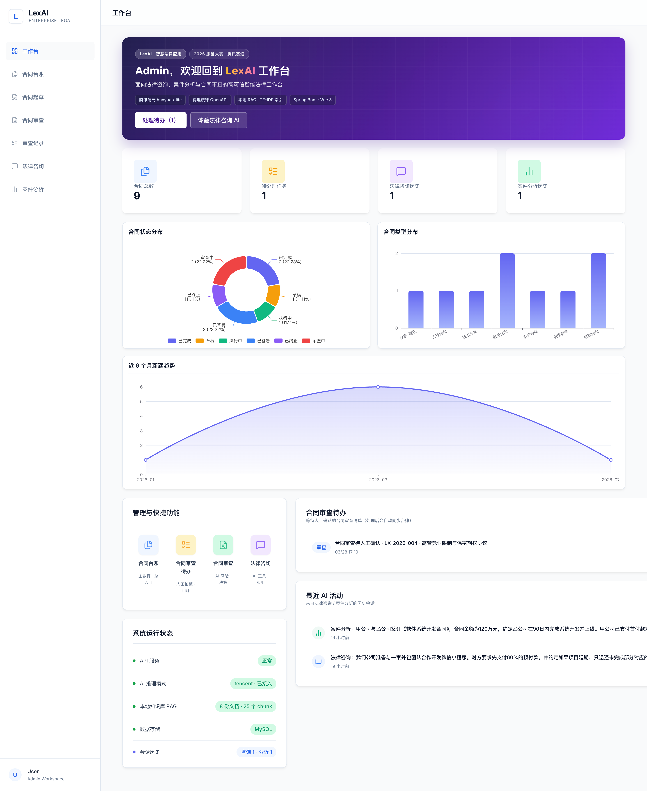

> 📷 **图 3-1**：浏览器打开后系统首页（工作台）的完整界面。

---

## 4. 界面总览与导航

系统采用「左侧导航栏 + 右侧内容区」的经典布局。

- **左上角**：LexAI 品牌标识，点击可返回工作台。
- **左侧导航栏**：在工作台、合同台账、合同起草、合同审查、审查记录、法律咨询、案件分析之间切换。
- **左下角**：当前用户信息（User · Admin Workspace）。
- **顶部标题栏**：显示当前所在页面的名称。
- **中间内容区**：各功能模块的主操作区域。

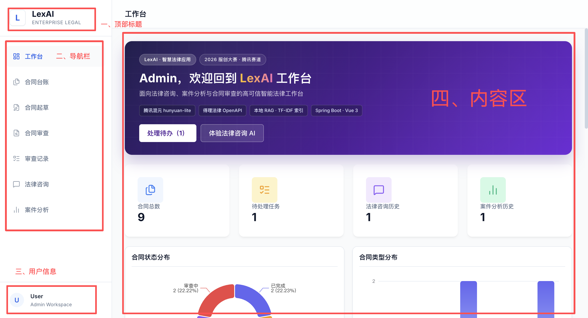

> 📷 **图 4-1**：标注出"①左侧导航栏 ②顶部标题 ③内容区 ④用户信息"四个区域的界面截图

| 导航项 | 功能页面 |
|--------|----------|
| 🏠 工作台 | 数据总览首页 |
| 📁 合同台账 | 合同列表与详情 |
| ✏️ 合同起草 | AI 起草合同 |
| 🔍 合同审查 | 单份合同 AI + 人工审查 |
| ✅ 审查记录 | 审查流程待办与记录 |
| 💬 法律咨询 | 法律问题智能咨询 |
| 📊 案件分析 | 案情结构化分析 |

---

## 5. 工作台（Dashboard）

工作台是登录后的默认首页，用于快速掌握系统整体状态。

### 5.1 页面构成

1. **欢迎横幅**：展示产品定位与技术标签，并提供「处理待办」「体验法律咨询 AI」两个快捷按钮。
2. **核心指标卡**：合同总数、待处理任务、法律咨询历史数、案件分析历史数。
3. **合同数据图表**：按状态、类型、月度趋势展示合同分布（ECharts 图表）。
4. **管理与快捷功能**：合同台账、合同审查待办、合同审查、法律咨询四个快捷入口。
5. **系统运行状态**：API 服务、AI 推理模式、本地知识库 RAG、数据存储、会话历史等实时状态。
6. **合同审查待办**：等待人工确认的合同审查清单，可一键「去处理」。
7. **最近 AI 活动**：来自法律咨询 / 案件分析的最近会话，点击可跳转回对应页面。

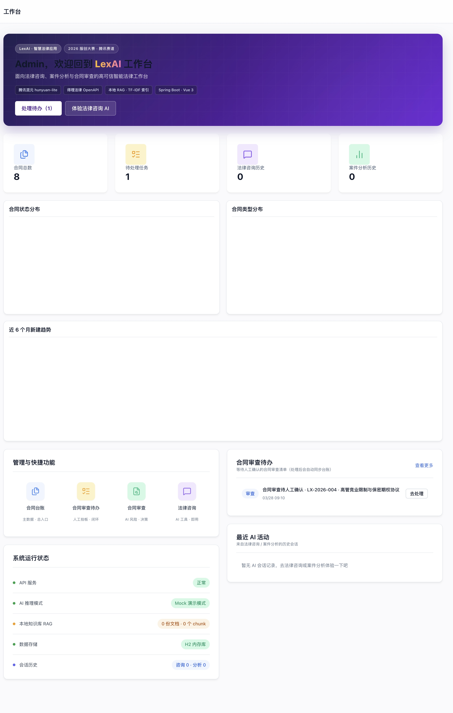

> 📷 **图 5-1**：工作台完整页面（含横幅、指标卡、图表、状态区）。

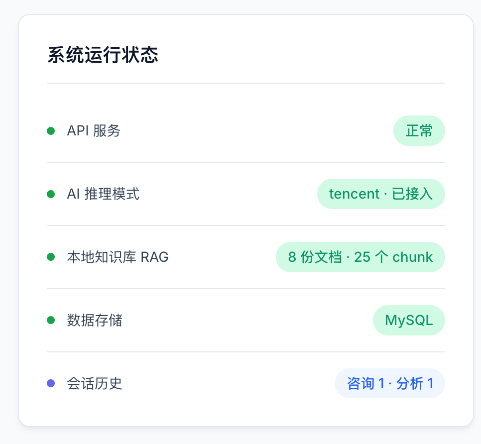

> 📷 **图 5-2**：「系统运行状态」卡片局部放大，重点展示"AI 推理模式"一行（用于说明当前是真实模式还是 Mock 模式）。

### 5.2 操作说明

- 点击任意**指标卡 / 快捷功能按钮**，可跳转到对应功能页。
- 「合同审查待办」中点击「去处理」，进入审查流程记录页。
- 「最近 AI 活动」中点击任意一条记录，跳转回法律咨询或案件分析页。

---

## 6. 法律咨询

针对具体法律问题，获取专业的智能分析报告。

### 6.1 操作步骤

1. 左侧导航栏点击「法律咨询」。
2. （可选）点击页面顶部的**快捷选填标签**（如"劳动报酬争议""合同违约处理""婚姻家事咨询"），一键填充示例问题。
3. 在「咨询问题」文本框中描述你遇到的法律问题。
   > 例如：公司未签劳动合同且拖欠工资，我应该如何维权？
4. 在「补充事实」输入框中填写关键事实，用逗号 / 顿号分隔（系统会自动拆分为标签）。
   > 例如：工作满 6 个月，未缴社保，有聊天记录
5. 点击「开始分析」按钮（问题为空时按钮不可点击）。
6. 等待 AI 推演（界面会展示思考步骤动画），随后右侧生成**专业分析报告**。

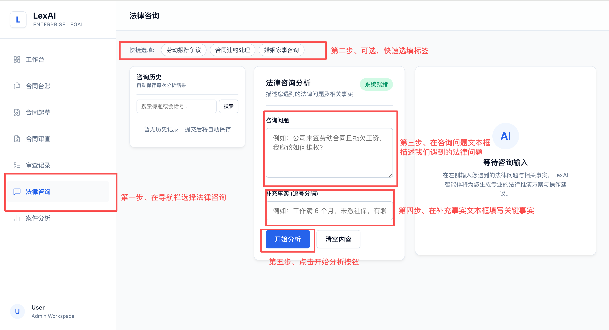

> 📷 **图 6-1**：法律咨询输入区，已填写问题与补充事实标签。

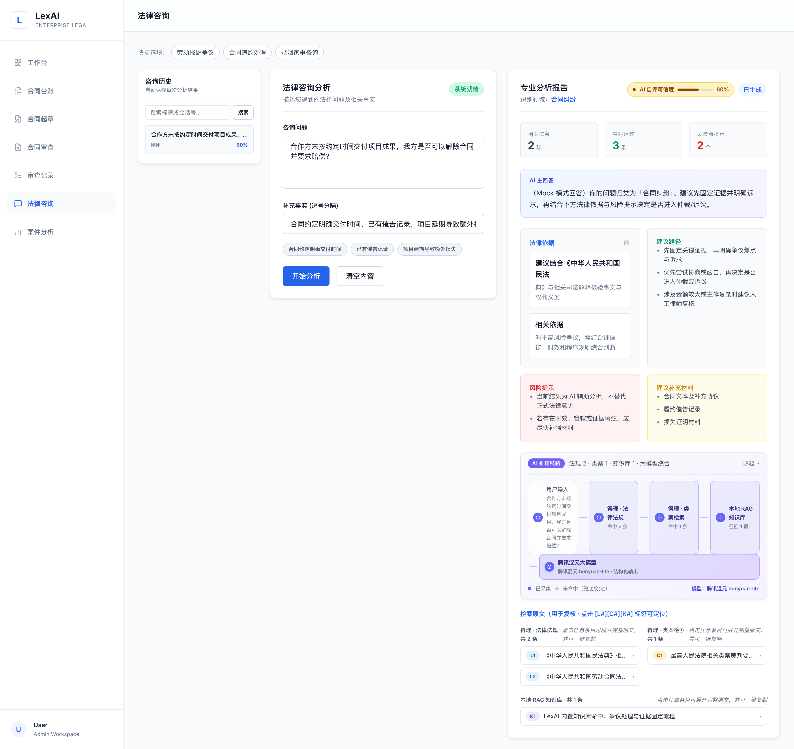

> 📷 **图 6-2**：AI 示例分析结果。

### 6.2 报告内容解读

生成的报告包含：

- **识别领域**与**置信度徽章**（Confidence）。
- **指标行**：相关法条数、应对建议数、风险点数。
- **AI 主回答**：核心结论。
- **法律依据**：逐条列出，支持点击右上角 📋 复制全部。
- **建议路径** / **风险提示** / **建议补充材料**。
- **AI 推理链路（Trace）**：展示调用了哪些法规、类案、知识库。
- **检索原文**：法律法规 / 类案 / 本地知识库原文，正文中的 `[L#] [C#] [K#]` 标签可点击定位到对应来源。

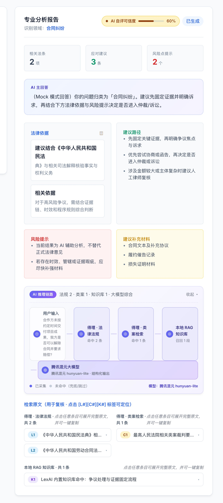

> 📷 **图 6-3**：完整的法律咨询分析报告（含主回答、法律依据、风险提示等）。

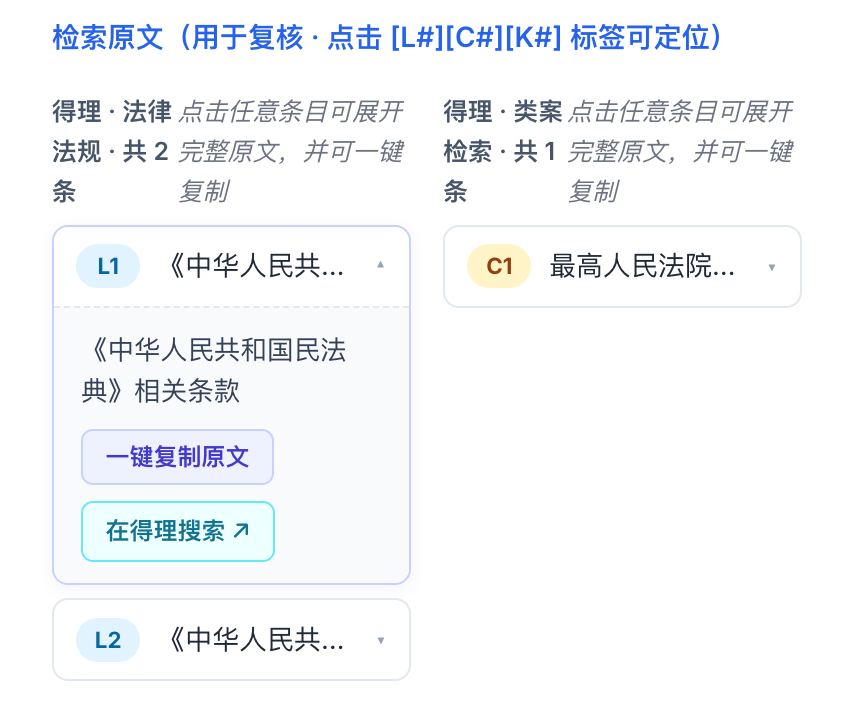

> 📷 **图 6-4**：点击正文中 `[L1]` 标签后，右下方检索原文对应条目被高亮的效果。

### 6.3 其他操作

- **清空内容**：点击「清空内容」按钮重置输入与结果。
- **历史恢复**：每次分析自动保存，可在左侧「咨询历史」侧栏恢复（详见第 12 章）。

---

## 7. 案件分析

输入案情与证据，获得案件结构化画像。

### 7.1 操作步骤

1. 左侧导航栏点击「案件分析」。
2. （可选）点击顶部「典型案由」标签快速填充示例。
3. 在「案情描述」中输入案件背景、双方争议点与履约经过。
4. 在「已掌握证据」中填写现有证据，逗号分隔（如：合同文本、付款凭证、微信聊天记录）。
5. 点击「生成案件画像」（案情为空时不可点击）。
6. 等待解析，右侧生成结构化画像。

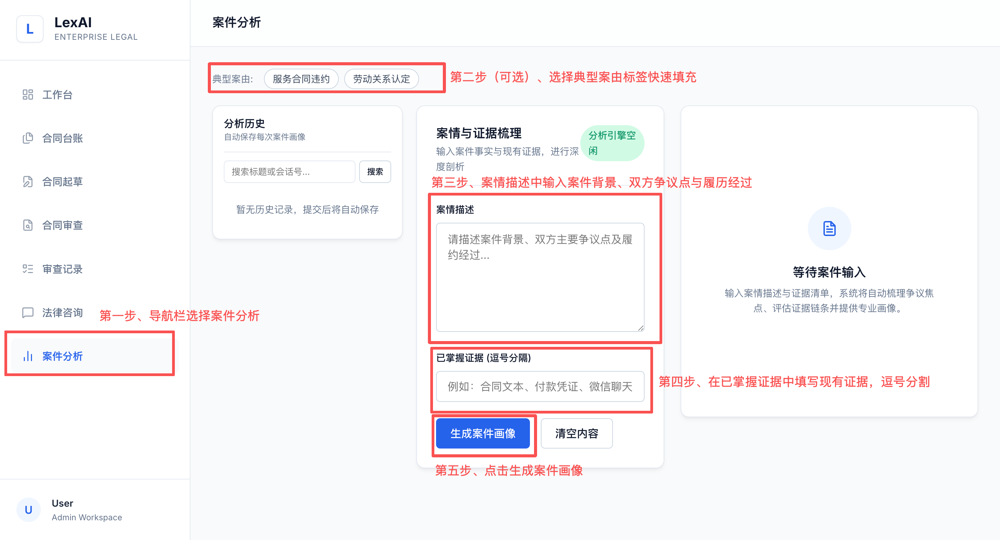

> 📷 **图 7-1**：案件分析输入区（已填写案情与证据标签）。

### 7.2 画像内容

- **证据链完整度**估算（百分比）与**置信度徽章**。
- **指标行**：关键事实数、争议焦点数、证据缺口数。
- **关键事实提取** / **核心争议焦点** / **证据缺口与薄弱点** / **后续建议动作**（可一键复制）。
- **AI 推理链路**与**检索原文**（类案、本地知识库，支持 `[C#] [K#]` 标签定位）。

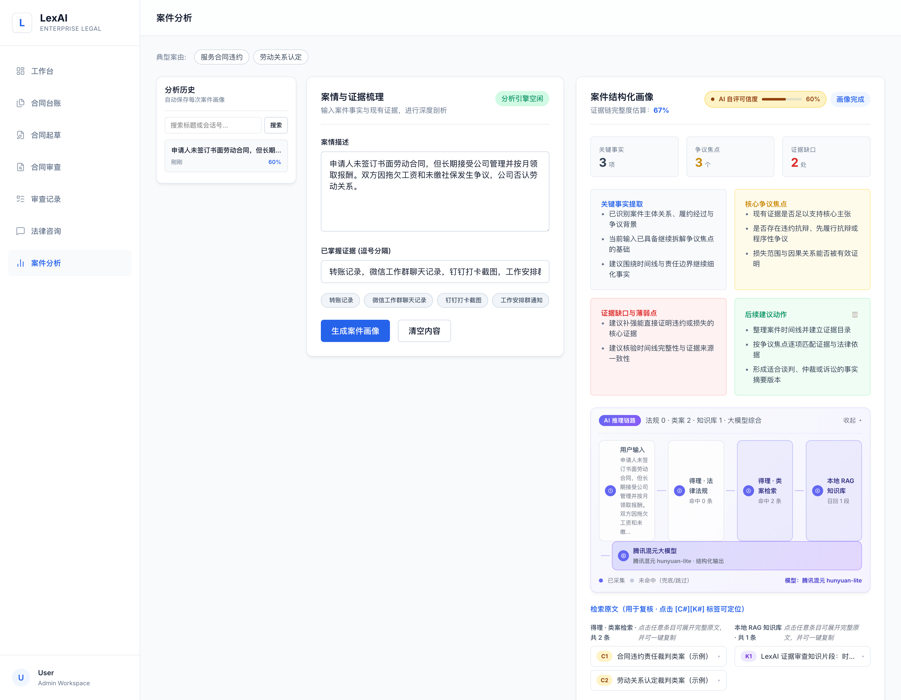

> 📷 **图 7-2**：完整的案件结构化画像报告。

---

## 8. 合同起草

由 AI 根据元信息自动生成合同正文，并支持人机协同修改。

### 8.1 进入方式

- 左侧导航栏点击「合同起草」；或
- 在**工作台 / 合同台账**点击「新建合同」。

### 8.2 操作步骤

1. 在顶部**合同名称**输入框填写合同标题。
2. 填写**合同基础元信息**：甲方名称、乙方名称、合同金额、合同类型。
3. 生成正文，二选一：
   - **AI 生成**：点击右上角「生成合同」，AI 依据元信息与需求自动起草正文（界面显示起草思考动画）。
   - **手动撰写**：直接在「正文实时撰写区」输入或粘贴内容。
4. 生成后，正文下方会显示**置信度**与**检索来源**（参考了几条法规 / 几段知识库），点击可展开查看原文。

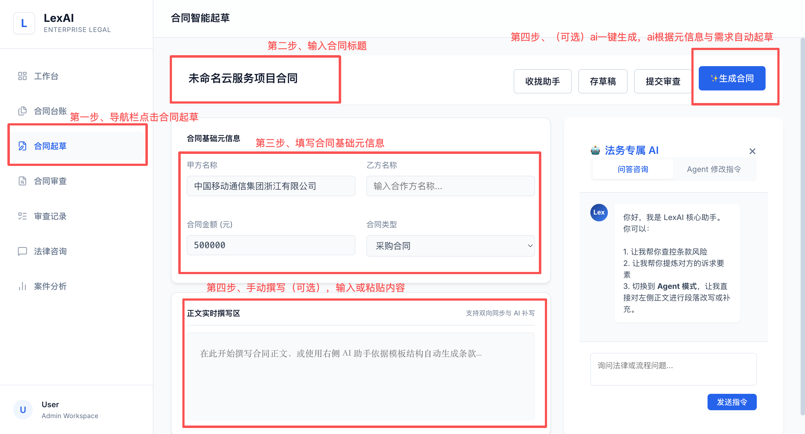

> 📷 **图 8-1**：合同起草页（左侧元信息 + 正文区，右侧 AI 助手）。

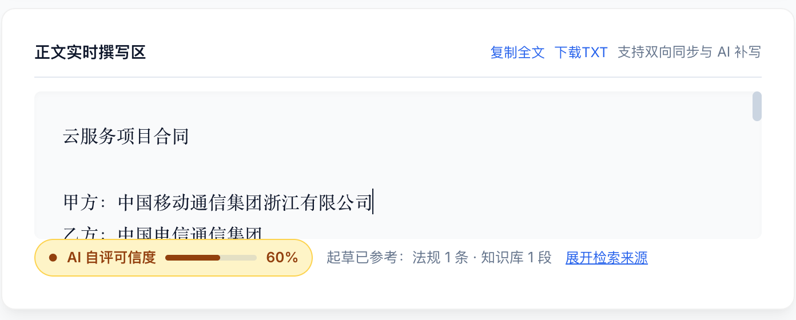

> 📷 **图 8-2**：点击「生成合同」后 AI 起草中的加载动画。

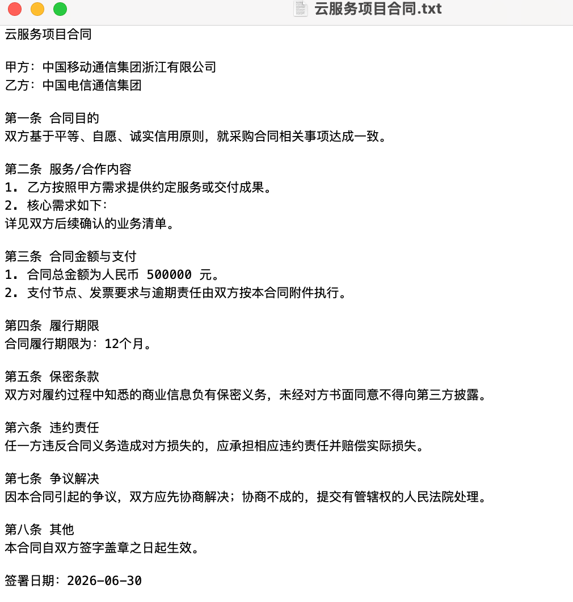

> 📷 **图 8-3**：生成完成后的合同正文与"起草已参考：法规 X 条 · 知识库 X 段"提示。

### 8.3 AI 助手（右侧边栏）

点击顶部「呼出助手 / 收拢助手」切换 AI 助手侧栏，支持两种模式：

- **问答咨询（ASK）**：就法律或流程问题向 AI 提问。
- **Agent 修改指令（AGENT）**：直接下达指令让 AI 改写左侧正文（例如："把违约金提升到 5%"）。

> 在输入框中输入后按 **Ctrl + Enter** 发送。

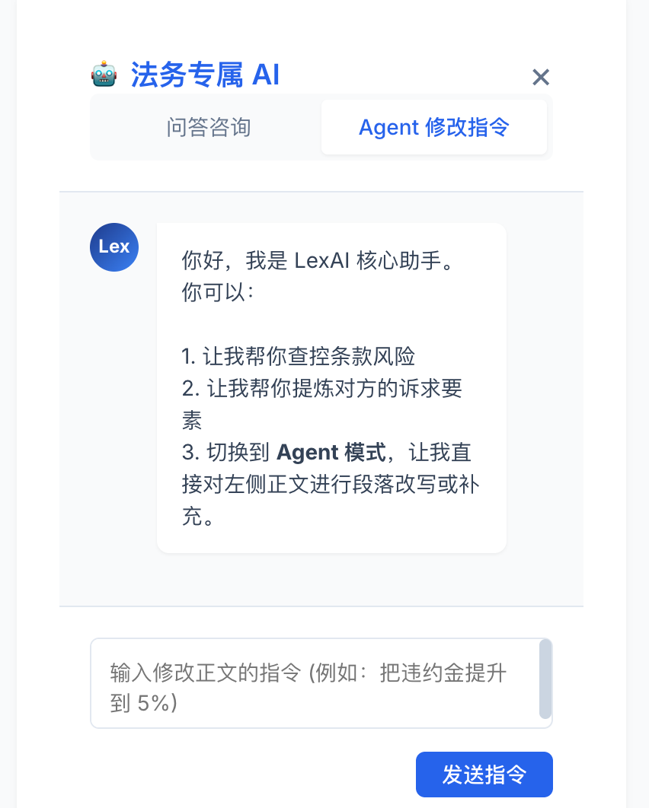

> 📷 **图 8-4**：AI 助手对话框，展示一次"Agent 修改指令"的问答。

### 8.4 保存与提交

顶部按钮区提供：

- **存草稿**：将合同以「草稿」状态保存到合同台账。
- **提交审查**：将合同状态推进为「审查中」，并进入审查流程（正文为空时不可点击）。
- **复制全文 / 下载 TXT**：导出当前正文。

---

## 9. 合同台账

合同主数据中心，是所有合同的总账与全生命周期入口。

### 9.1 查询与筛选

1. 左侧导航栏点击「合同台账」。
2. 使用筛选栏组合查询：
   - **合同关键字**：按名称或编号搜索（回车即查）。
   - **合同类型**：下拉选择。
   - **当前状态**：草稿 / 审查中 / 已签署 / 执行中 / 已完成 / 已终止。
3. 点击「查询」**应用筛选，**「重置」清空条件。

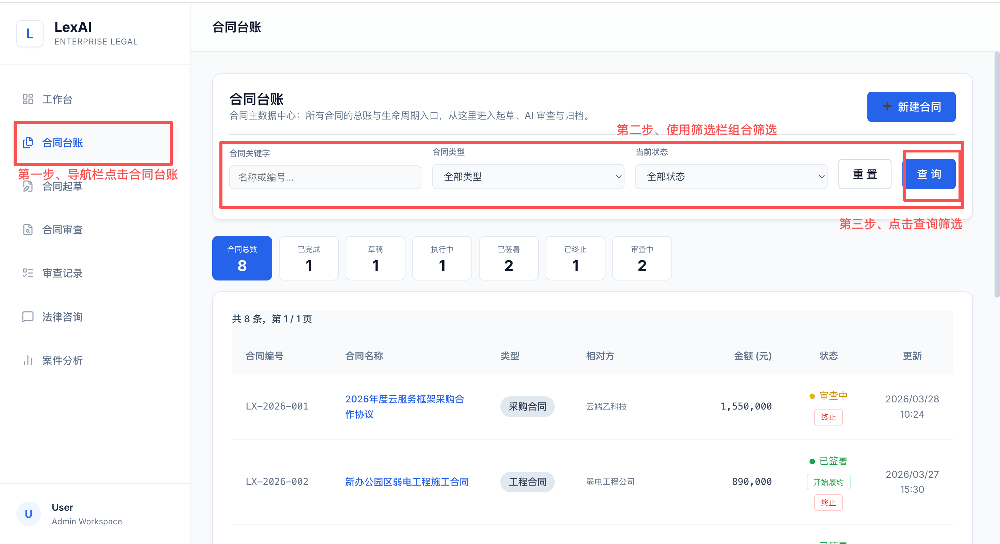

> 📷 **图 9-1**：合同台账列表页（含筛选栏、统计条、数据表格）。

### 9.2 列表与统计

- 顶部**统计条**：合同总数及各状态分布数量。
- **数据表格**：合同编号、名称、类型、相对方、金额、状态、更新时间。
- 表格底部支持**分页**（上一页 / 下一页）。

### 9.3 合同详情与生命周期

点击合同名称，下方展开**合同详情卡**，包含：

- 甲乙双方、金额、来源等基础信息。
- **合同生命周期进度条**：草稿 → 审查中 → 已签署 → 执行中 → 已完成，并高亮当前阶段、给出「下一步」指引。
- **状态推进按钮**（依当前状态动态显示）：
  - 草稿 → **提交审查**
  - 审查中（且 AI 审查通过）→ **标记已签署**
  - 已签署 → **开始履约**
  - 执行中 → **标记完成**
  - 非完成/终止态 → **终止**
- **继续编辑**（草稿态）、**提交 AI 审查 / 查看审查详情** 等快捷入口。

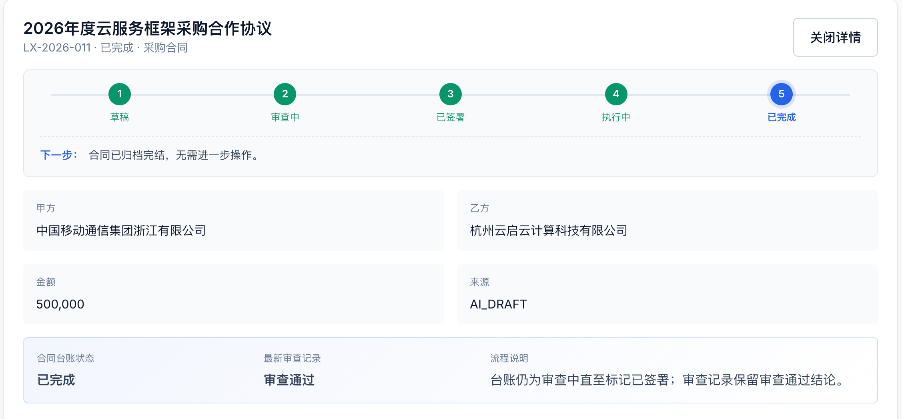

> 📷 **图 9-2**：展开后的合同详情卡（重点展示生命周期进度条与下一步指引）。

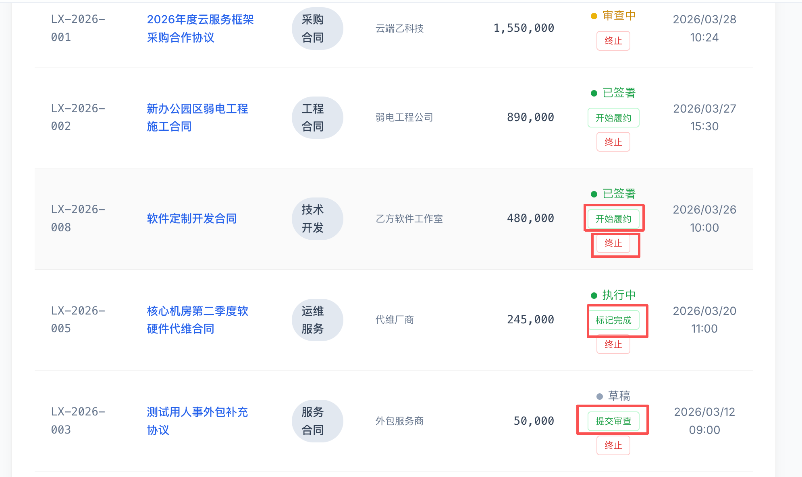

> 📷 **图 9-3**：合同状态推进按钮（如"提交审查""标记已签署"）的局部截图。

---

## 10. 合同审查

对单份合同执行 AI 风险识别 + 人工复核决策。

### 10.1 两种模式

页面顶部横幅会明确提示当前模式：

| 模式 | 触发方式 | 是否保存 |
|------|----------|----------|
| **合同流程审查** | 从合同台账 / 起草页对某份合同跳转进入 | ✅ 结果回写合同档案与流程记录 |
| **AI 试用模式** | 直接从导航栏进入并粘贴任意条款 | ❌ 不保存到台账，仅当前页展示 |

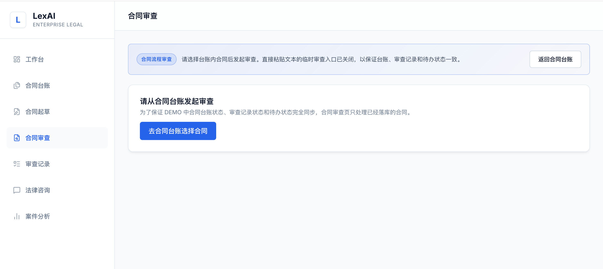

> 📷 **图 10-1**：页面顶部"合同流程审查"模式横幅（含合同编号/名称）。

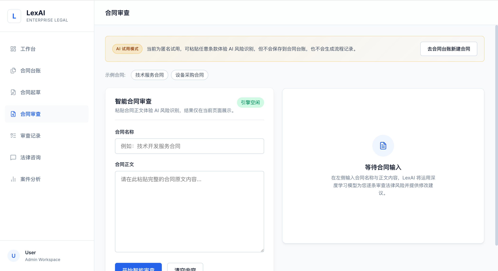

> 📷 **图 10-2**：页面顶部"AI 试用模式"横幅。

### 10.2 操作步骤

1. 进入合同审查页。
   - **流程审查模式**：正文自动从合同档案加载，可点击「修改正文」临时调整。
   - **试用模式**：手动填写合同名称、粘贴合同正文。
2. 点击「对该合同执行 AI 审查」（或试用模式的「开始智能审查」）。
3. AI 执行审查（含"二轮自检 ReAct"剔除幻觉），右侧生成**风控报告**。

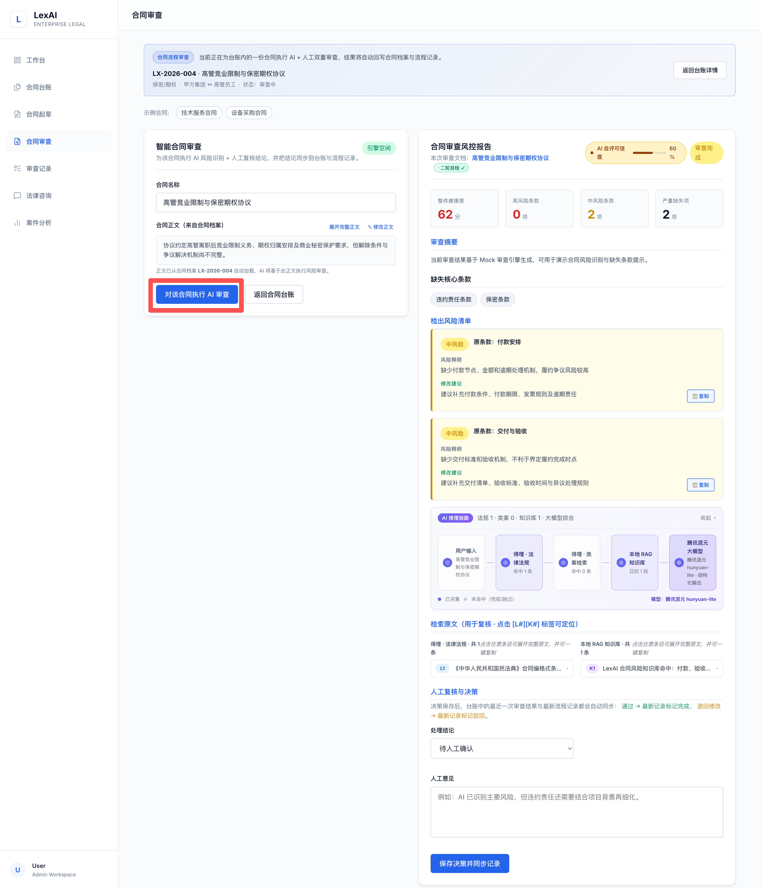

> 📷 **图 10-3**：AI 审查中的多步骤加载动画。

### 10.3 风控报告解读

- **整体健康度评分**（分）+ 置信度徽章。
- **指标行**：高风险条款数、中风险条款数、严重缺失项数。
- **审查摘要**。
- **缺失核心条款**（标签形式）。
- **检出风险清单**：逐条展示风险等级、原条款、风险释明、修改建议（可一键复制）。
- **AI 推理链路**与**检索原文**（法规、知识库，支持 `[L#] [K#]` 标签定位）。

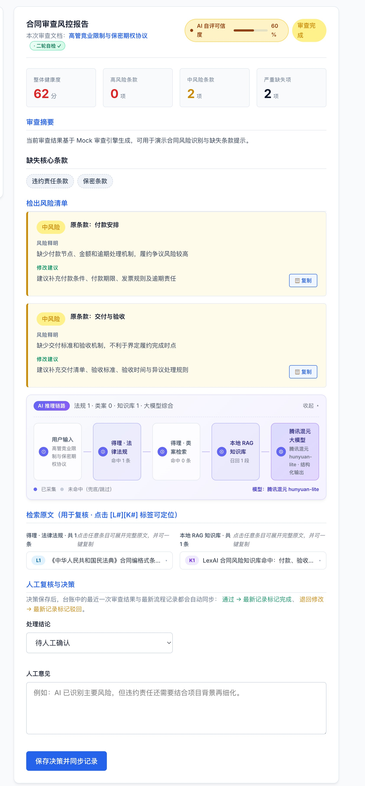

> 📷 **图 10-4**：完整合同审查风控报告（含健康度评分与风险清单）。

### 10.4 人工复核与决策（仅流程审查模式）

报告底部提供「人工复核与决策」区：

1. 在「处理结论」下拉选择：审查通过 / 退回修改 / 待人工确认。
2. 在「人工意见」中填写复核说明。
3. 点击「保存决策并同步记录」。

> 保存后，台账中的最近审查结果与最新流程记录会自动同步：
> **通过 → 流程记录标记完成**；**退回修改 → 流程记录标记驳回**。

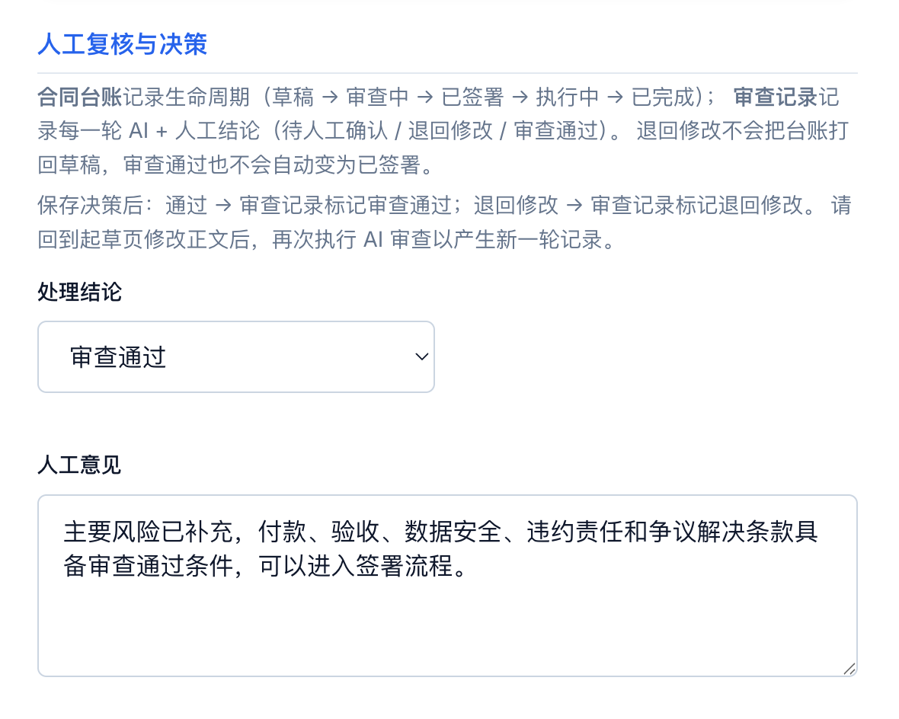

> 📷 **图 10-5**：人工复核与决策区（处理结论下拉 + 人工意见输入框）。

> ⚠️ 试用模式下没有决策区，页面会提示"先到合同台账新建合同后再执行完整审查"。

---

## 11. 合同审查流程记录

集中跟踪每一次合同审查申请，是人工决策的待办中心。

### 11.1 操作说明

1. 左侧导航栏点击「审查记录」。
2. 左侧**按状态筛选**：待处理 / 处理中 / 已覆盖 / 已完成 / 已驳回 / 全部。
3. 右侧列表展示每条审查任务，含：任务编号、合同 ID、发起人、创建时间、当前状态。
4. 对每条任务可：
   - 点击「查看合同档案」跳转到台账详情；
   - 点击「去审查 / 决策」进入合同审查页做出结论。

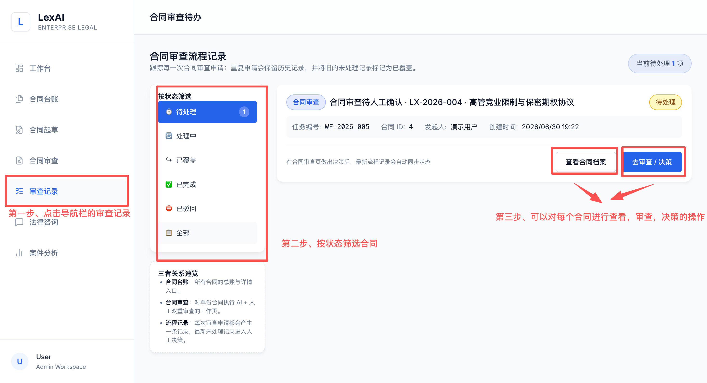

> 📷 **图 11-1**：审查流程记录页（左侧状态筛选 + 右侧任务卡片）。

> 💡 同一份合同重复提交审查时，旧的未处理记录会自动标记为「已被新申请覆盖」，确保只有最新申请进入人工决策。

---

## 12. AI 会话历史的查看与恢复

**法律咨询**与**案件分析**页面左侧均带有**历史侧栏**，每次分析结果会自动保存。

### 12.1 操作说明

- 侧栏按时间倒序列出历史会话，可**搜索关键字**快速定位。
- 点击任意历史条目，即可**一键恢复**当时的输入与分析结果到主区域。
- 在工作台「最近 AI 活动」中也可快速跳回最近的会话。

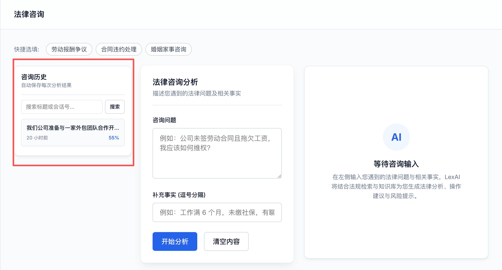

> 📷 **图 12-1**：法律咨询页左侧"咨询历史"侧栏，含搜索框与历史列表。

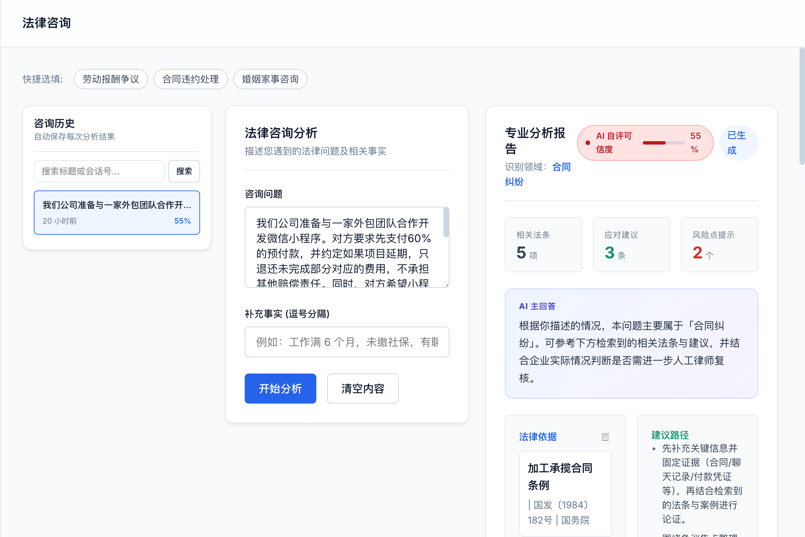

> 📷 **图 12-2**：点击历史条目后恢复出完整分析结果的效果。

---

## 13. 常见问题（FAQ）

**Q1：页面打不开 / 显示加载失败？**
A：确认已执行 `./start.sh`（或 `start.bat`）且终端无报错；前端 http://localhost:5173、后端 http://localhost:8081/api 均需正常。

**Q2：AI 分析结果看起来是"演示数据"？**
A：系统当前处于 **Mock 演示模式**。如需真实结果，请配置腾讯混元与得理平台密钥（参见 `docs/AI接口密钥配置与调用操作指南（成员通用）.md`），并将 AI 模式切换为 `tencent`。可在工作台「系统运行状态 → AI 推理模式」确认当前模式。

**Q3：合同审查页为什么没有"人工决策"区？**
A：你当前处于 **AI 试用模式**。请先到合同台账新建合同，再从台账详情或起草页进入审查，即可使用完整的决策与同步功能。

**Q4：复制按钮没反应？**
A：在非 HTTPS 环境下系统会自动降级使用兼容方式复制；若仍失败，可手动选中文本复制。

**Q5：历史记录会丢失吗？**
A：会话历史保存在后端数据库中。若使用内置 H2（未配置 MySQL），重启后端可能清空数据；正式使用建议配置 MySQL 持久化。

---


*— 本手册随系统功能持续更新 —*
