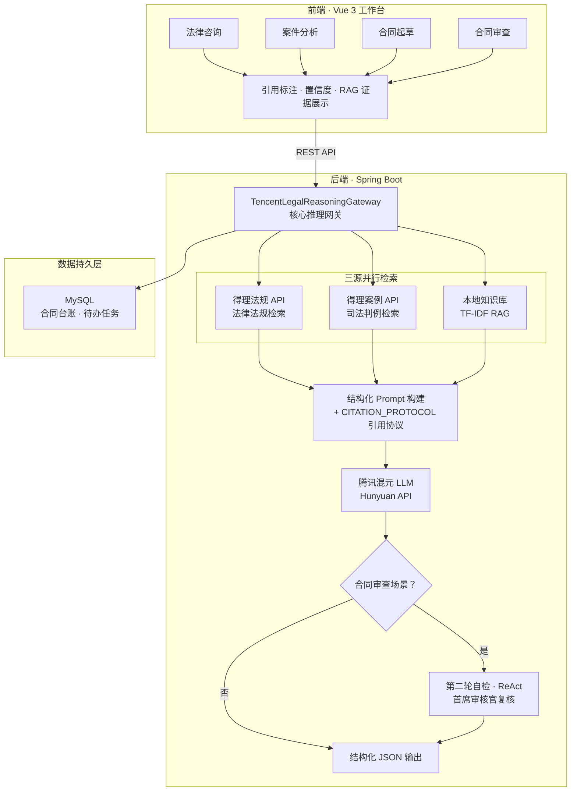
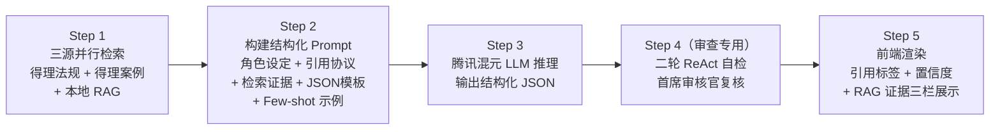

# LexAI — 智慧法律全链路工作台

## 一、项目基础信息

**项目名称**：LexAI · 智慧法律全链路工作台

**参赛方向**：系统解决方案 — 面向企业法务与个人用户的智能法律服务平台

**核心定位**：基于腾讯混元大模型（Hunyuan）与得理法律开放平台 API，辅以本地法律知识库 RAG 检索引擎，构建覆盖「法律咨询 → 案件分析 → 合同起草 → 合同审查」全链路的一站式智慧法律工作台。

**技术栈**：前端 Vue 3 + TypeScript，后端 Spring Boot + Java 17 + MySQL，AI 层由腾讯混元 LLM 与得理开放平台 API 联合驱动。

**在线地址**：http://124.223.111.253 （已部署上线，可直接体验）

**开发工具**：全程使用 CodeBuddy 辅助代码开发与调试；腾讯混元大模型作为核心推理引擎；得理开放平台 API 提供法律法规与案例检索能力。

---

## 二、项目需求分析

### 2.1 行业痛点

当前法律服务行业存在三大核心矛盾，也是 LexAI 立项的出发点：

**痛点一：案件激增与法律服务资源严重不均。** 我国每年民商事案件超过 1500 万件，但执业律师仅约 67 万人。大量中小企业和个人无法获得及时、专业的法律支持，尤其在劳动纠纷、合同争议等高频场景，用户往往因不了解自身权益而错过维权窗口期。

**痛点二：合同审查效率低，风险成本高。** 企业法务部门平均每份合同审查耗时 2-4 小时，但仍有约 23% 的商业纠纷源于合同条款漏洞——违约金缺失、保密条款不完整、知识产权归属模糊等。传统人工审查高度依赖个人经验，对非典型风险的识别覆盖率有限。

**痛点三：AI 幻觉与法律严肃性的根本冲突。** 通用大模型在法律领域容易产生"听起来很专业但实际错误"的幻觉输出——编造不存在的法条、引用错误的案例编号。法律行业对准确性和可追溯性要求极高，不可溯源的 AI 输出不仅无用，反而可能造成严重误导。

### 2.2 目标用户画像

LexAI 精准锚定四类目标用户群体：

**中小企业法务人员**，核心需求是快速起草和审查合同、降低法律风险，典型场景包括日常合同管理和供应商协议审查。

**初创公司创业者**，核心需求是以极低成本获取基础法律咨询，典型场景包括劳动合同拟定、股权协议起草和融资条款评估。

**普通个人用户**，核心需求是在劳动争议、租房纠纷、消费维权等场景下快速了解自身权益并获得维权策略。

**法学院学生与实习律师**，核心需求是通过案例分析训练提升实务能力，快速检索法条和判例。

### 2.3 需求提炼

综合痛点与用户画像，LexAI 需要满足四项核心需求：

1. **能问** — 用户用自然语言描述法律问题，AI 给出结构化的咨询答案，而非简单的文本回复。
2. **能写** — 输入合同基本要素，AI 自动起草符合法律规范的完整合同文书。
3. **能查** — 输入合同文本，AI 自动识别风险条款和缺失条款，给出专业修改建议。
4. **可追溯** — 所有 AI 输出必须附带法条/案例引用标注，用户可一键查看引用原文，从根本上解决幻觉问题。

---

## 三、解决方案思路

### 3.1 整体架构

LexAI 采用「检索增强生成 (RAG) + 结构化 Prompt + 二轮自检」三层架构设计，将大模型的生成能力约束在法律专业性的框架之内。

整体数据流如下图所示：

### 3.2 核心设计理念

**理念一：三源检索，证据先行。** 每次 AI 推理之前，系统同时从三个独立数据源检索证据——得理法律法规 API 检索现行有效法规（编号 L1, L2, ...），得理类案 API 检索相似司法判例（编号 C1, C2, ...），本地知识库 RAG 基于 TF-IDF 算法匹配民法典解读、合同模板要点等专业文本（编号 K1, K2, ...）。三路证据作为 Prompt 上下文一同注入腾讯混元大模型，确保 AI 的每一句输出都"有据可查"。

**理念二：结构化 JSON + 强制引用协议（CITATION_PROTOCOL）。** 所有 Prompt 都要求大模型以严格的 JSON 格式输出，并通过自研的强制引用协议，要求模型在每一条法律建议、每一条风险提示的末尾附带 `[L#]`、`[C#]`、`[K#]` 引用标记，无可引用时必须显式标注 `[N/A]`。前端解析这些标记后渲染为可点击的引用标签，实现"点击 [L1] → 自动展开《劳动合同法》第十条原文"的可追溯体验。

**理念三：二轮自检（ReAct 模式）。** 在合同审查这一对准确性要求最高的场景中，LexAI 创新性地引入了二轮自检机制。第一轮由 LLM 基于合同正文和检索证据给出初步审查结论；第二轮 LLM 切换为"首席审核官"角色，对第一轮结论逐条复核——剔除可能的幻觉、补齐遗漏的风险点、校准整体置信度。这种受 ReAct 论文启发的双轮推理方式，显著提升了审查结论的可靠性。

### 3.3 AI 调用工作流

以下是一次完整 AI 调用的五步流程：

---

## 四、关键功能说明

### 4.1 法律智能咨询

用户以自然语言描述法律问题，可选补充相关事实。系统自动调用得理法规检索、得理案例检索和本地 RAG 三路并行获取证据，随后通过结构化 Prompt 交由腾讯混元进行推理。最终输出包含自然语言答复正文、法律依据列表、可执行的行动建议、风险提示以及 AI 自评可信度。每一条输出都附带 `[L#][C#][K#]` 引用标注，用户点击即可查看法条或案例原文。

### 4.2 案件智能分析

用户输入案情摘要和证据清单，系统调用得理类案检索与本地 RAG 获取相似判例和知识库片段，交由混元进行分析推理。输出包含关键事实提炼、争议焦点识别、证据缺口分析以及诉讼/谈判策略建议。系统自动将案情与类案判例比对，帮助用户建立"争议点→证据→法律依据"的完整对应关系，所有结论均附带引用标注和置信度。

### 4.3 合同智能起草

用户填入甲乙方名称、合同类型、金额、期限和特殊要求等基本要素。系统先从本地知识库检索同类合同模板，再调用得理法规检索相关条款，构建 Prompt 交由混元生成包含标准条款（服务范围、费用支付、权利义务、保密、违约责任、争议解决等）的完整合同正文。起草页面右侧内嵌了一个法务 AI 助手侧边栏，用户可以随时在问答模式下询问"违约金 5% 合理吗？"，也可以切换到 Agent 模式用自然语言指令直接修改左侧合同正文（例如"把保密期限从 3 年改为 5 年"）。

### 4.4 合同智能审查（二轮自检）

用户输入合同标题和完整正文，系统调用得理法规检索和本地 RAG 获取法条与知识库证据。第一轮由混元 LLM 对合同逐条分析，输出风险条款列表（含风险等级 LOW/MEDIUM/HIGH、问题描述和修改建议）、缺失条款提示和审查总结。第二轮 LLM 以"首席审核官"角色对第一轮结论进行复核，剔除幻觉、补齐遗漏、校准置信度后输出最终结论。每一条风险建议和缺失条款提示都附带法条引用标注，支持一键溯源。

### 4.5 合同台账与待办任务闭环

系统提供合同全生命周期管理能力，支持「草稿 → 提交审查 → 审查中 → 审查通过/需修改 → 归档」完整状态流转。合同审查完成后自动生成待办任务进入待办池，相关责任人可在待办页面查看审查报告并处理。整个流程实现了从"起草→审查→整改→归档"的闭环管理，所有环节数据互通。

---

## 五、项目使用场景

### 场景一：劳动纠纷咨询

小王在一家公司工作 4 个月，公司始终未与他签订书面劳动合同就突然将其辞退。小王打开 LexAI 法律咨询页面，输入"公司没签劳动合同就辞退我，能要求什么赔偿？"。系统自动检索到《劳动合同法》第 10 条、第 82 条等现行法规，以及多个同类裁判案例。混元大模型基于这些证据给出明确结论——可主张未签书面合同的二倍工资差额、违法解除劳动合同的经济赔偿金——同时附带完整的法条原文引用和证据准备建议。小王点击引用标签即可查看每一条法条的完整内容，确认 AI 的答案有据可依。

### 场景二：创业公司合同起草

创业者小李需要和一家外包团队签订软件开发服务合同，但他没有法律背景也请不起律师。他在 LexAI 合同起草页面填入甲乙方信息、金额 50 万、服务期限 6 个月，并在特殊要求栏写上"知识产权归甲方所有，验收周期 30 天，违约金不低于合同金额的 5%"。系统从知识库中检索到同类服务合同模板，结合相关法规要求，生成了一份包含八大标准条款的完整合同。小李还在右侧 AI 助手中追问"违约金 5% 是否合理"，AI 基于法条给出了"通常约定范围在 3%~10%，5% 属于合理区间"的专业分析。

### 场景三：法务部门合同审查

企业法务小张收到一份供应商合同，需要在半小时内完成审查。她在 LexAI 合同审查页面提交全文。系统进行二轮 AI 审查：第一轮识别出"违约金约定过低（日万分之一，年化仅 3.65%）"、"缺少知识产权归属条款"、"保密期限未明确约定"等 5 项风险；第二轮自检确认前述风险成立，并补充发现"缺少不可抗力免责条款"，同时将整体置信度从 0.72 上调至 0.85。每条建议旁都有蓝色引用标签，小张点击即可查看《民法典》和相关法规的对应条文。

---

## 六、AI 工具使用说明（工作流与 Prompt）

### 6.1 腾讯系 AI 工具组合

**腾讯混元大模型（Hunyuan）** 是 LexAI 的核心推理引擎。系统通过混元 Chat Completions API 完成法律咨询推理、合同起草生成、案件事实分析、合同条款审查以及二轮自检的全部 LLM 调用。调用参数设置 temperature = 0.2（确保法律输出的严谨性）、max_tokens = 4096（保证长文本合同和审查报告的完整性）。

**得理开放平台 API** 是 LexAI 的权威法律数据源。系统调用得理 `queryListLaw` 接口检索现行有效法律法规（为咨询和审查提供法条证据），调用 `queryListCase` 接口检索司法判例（为案件分析和咨询提供裁判参考）。两个接口在每次 AI 推理前并行调用，检索结果作为 RAG 证据注入 Prompt 上下文。

**CodeBuddy** 在整个项目开发过程中作为 AI 编程助手全程参与，辅助完成了前后端代码架构设计、功能模块开发、Bug 调试修复以及部署脚本编写。

**本地法律知识库 RAG 引擎** 作为得理 API 的补充，基于 TF-IDF 检索算法索引了民法典核心条文解读、常见合同模板要点集、侵权责任法司法解释等专业法律文本，chunk_size 为 320 字符、chunk_overlap 为 60 字符，确保检索时既不丢失上下文又能精准匹配。

### 6.2 AI 调用工作流详解

一次完整的 AI 调用包含以下五个步骤：

**Step 1 · 三源并行检索。** 用户输入到达后端后，系统同时发起三路检索请求——得理法规 API 返回最相关的法律法规（标记为 [L1]~[L5]），得理案例 API 返回相似司法判例（标记为 [C1]~[C5]），本地 RAG 引擎返回知识库最佳匹配片段（标记为 [K1]~[K3]）。三路检索互不依赖，并行执行以减少延迟。

**Step 2 · 构建结构化 Prompt。** 系统将检索结果与用户输入组装成四层结构的 Prompt。第一层是 System Prompt（角色设定），如"你是一名拥有 15 年执业经验的中国律师"；第二层是 CITATION_PROTOCOL（强制引用协议），要求模型每条输出末尾必须附带引用标记；第三层是 User Prompt，包含用户问题、事实描述、三路检索证据以及期望的 JSON 输出结构定义；第四层是 Few-shot 示例，用一个完整的正确输出示范教会模型如何正确使用引用标记。

**Step 3 · 腾讯混元 LLM 推理。** 组装好的 Prompt 通过 HTTP 发送至腾讯混元 API，模型返回结构化 JSON，包含分类结论、法律依据、行动建议、风险提示和置信度评分。

**Step 4 · 二轮自检（仅合同审查）。** 在合同审查场景下，系统将第一轮输出的 JSON 连同原始合同和检索证据再次提交给混元，但 System Prompt 切换为"首席审核官"角色，要求模型逐条复核第一轮结论——剔除可能的幻觉、补齐遗漏的风险点、调整置信度。第二轮输出作为最终结论返回。

**Step 5 · 前端渲染与交互。** 前端接收到 JSON 后，解析所有 `[L#]`、`[C#]`、`[K#]` 引用标记，渲染为可点击的彩色标签。法规引用为蓝色、案例引用为橙色、知识库引用为紫色。用户点击标签即可展开对应的法条或案例原文。页面同时展示置信度进度条和三栏 RAG 检索原文列表。

### 6.3 核心 Prompt 设计

所有 Prompt 均遵循「角色设定 + 强制引用协议 + 结构化 JSON 模板 + Few-shot 示例」四层结构。以下展示两个最核心的 Prompt 设计。

**CITATION_PROTOCOL（强制引用协议）** — 这是 LexAI 最核心的 Prompt 创新。协议要求大模型在输出 JSON 的每一个字符串数组项和总结性字段的末尾，都必须附带来自检索编号集合的方括号引用（法条 `[L#]`、类案 `[C#]`、知识库 `[K#]`）。若确实没有可对应的引用，必须显式追加 `[N/A]` 占位，严禁省略或编造。该协议使得前端可以精确解析每一个引用标记，实现点击溯源的可追溯体验，从 Prompt 层面解决了大模型在法律场景下的幻觉问题。

**法律咨询 Prompt** — System Prompt 设定角色为"15 年执业经验的中国律师"并附加引用协议。User Prompt 包含用户问题、相关事实、三路检索证据（每条编号标记）、输出 JSON 结构定义（category、answer、legalBasis、recommendations、riskAlerts、confidence），以及一个完整的 Few-shot 正确示例展示引用格式的标准用法。

**合同审查二轮自检 Prompt** — 第二轮 System Prompt 将角色切换为"极其严谨的合同审查首席审核官"。User Prompt 包含原始合同正文、检索到的法条和知识库片段，以及第一轮输出的完整 JSON。模型被要求逐条审视第一轮结论，确保每条 risk 和 missingClause 都能在合同正文或法条中找到实际依据，并输出修正后的最终版 JSON。

### 6.4 关键技术参数

LLM 调用使用腾讯混元 Pro 版本，temperature 设为 0.2 以确保法律输出严谨一致，max_tokens 设为 4096 以保证长合同和详细审查报告的完整生成。本地 RAG 引擎的 chunk_size 为 320 字符、chunk_overlap 为 60 字符，兼顾检索精度与上下文完整性。合同审查二轮自检默认开启，可通过配置项按需关闭以降低响应延迟。

---

## 附录：项目创新点总结

**创新一：三源并行 RAG 检索。** 得理法规、得理案例、本地知识库三路独立检索同时执行，构建多维度、多层次的证据基础，避免单一数据源的局限性。

**创新二：CITATION_PROTOCOL 强制引用协议。** 自研的 Prompt 层引用约束机制，确保 AI 输出的每一句话都可追溯到具体法条或案例原文，前端实现一键点击查看，从根本上解决法律 AI 的幻觉信任问题。

**创新三：二轮 ReAct 自检。** 合同审查场景引入受 ReAct 论文启发的"首席审核官"二次复核机制，由第二轮 LLM 审视第一轮结论的每一个判断是否有合同文本或法条支撑，显著降低幻觉误报率和风险遗漏率。

**创新四：置信度自评机制。** AI 对每次输出给出 0~100% 的可信度自评分数，用户可据此判断是否需要进一步的人工律师复核，实现"AI 辅助决策，人工把关兜底"的安全模式。

**创新五：合同起草内嵌实时 AI 助手。** 起草页面右侧内嵌法务 AI 对话窗口，支持问答模式（随时咨询条款合理性）和 Agent 模式（用自然语言指令直接修改合同正文），做到"起草与咨询一体化"。

**创新六：全链路工作流闭环。** 从法律咨询、合同起草、合同审查到待办任务和台账归档，所有环节数据互通、状态流转可追踪，形成完整的业务闭环，而非孤立的 AI 对话工具。
